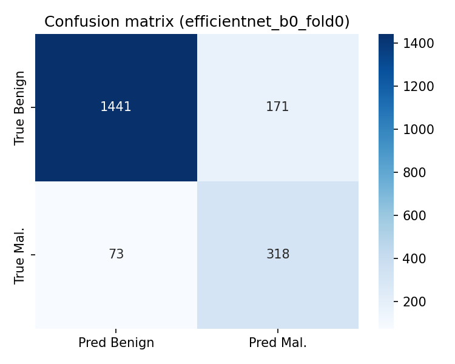
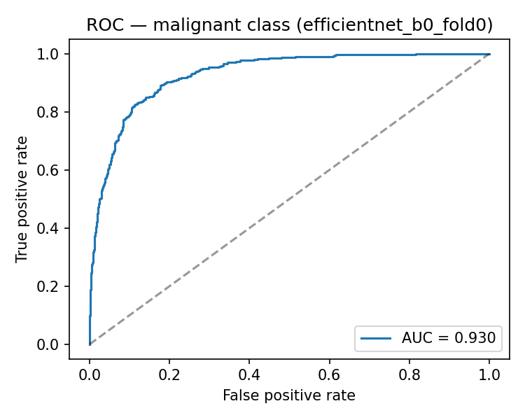
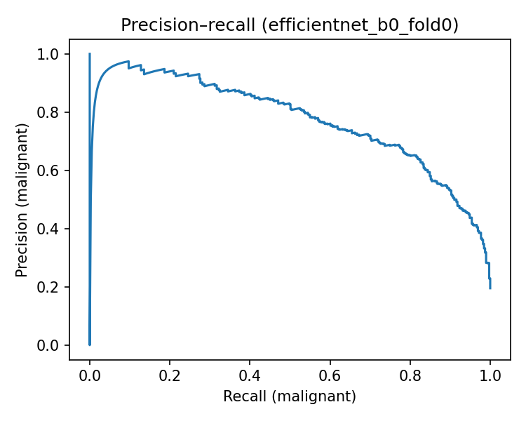
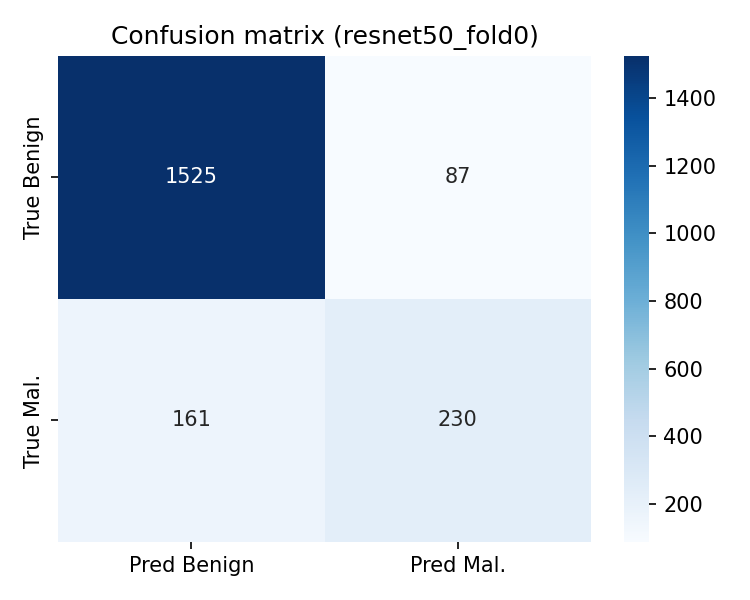
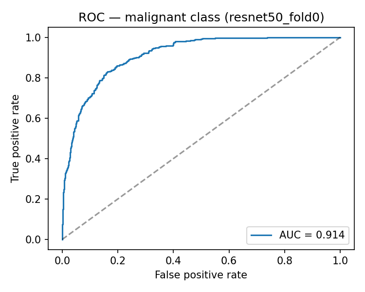
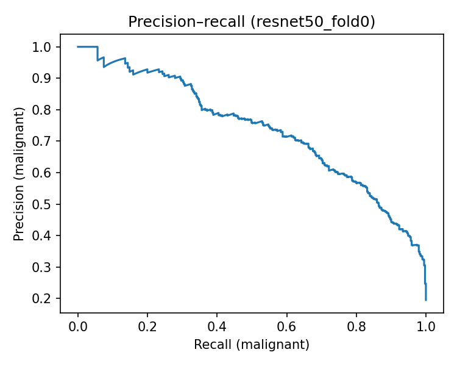

# Model evaluation (research prototype)

## Served model — EfficientNet-B0 (recommended)

**Checkpoint:** `models/checkpoints/best_binary_efficientnet_b0_fold0.pt`  

After full **ImageNet-pretrained** fine-tuning (10 epochs, same binary split as training), **EfficientNet-B0** beats **ResNet-50** on the **held-out validation** fold used in `evaluate.py`: higher **ROC-AUC** (malignant vs benign), higher **F1** for the malignant class, slightly higher **accuracy**, and **fewer false negatives** (missed “Potentially Malignant” labels). ResNet-50 has fewer false positives but many more false negatives; for screening-style tradeoffs we prioritize the model with better discrimination (ROC-AUC) and fewer FN.

**Machine-readable output:** `docs/assets/eval_efficientnet_b0_fold0.json`

| Item | Value |
|------|-------|
| **Validation images scored** | **2003** |
| **Training images excluded** | **8012** |
| **Accuracy** | **0.8782** (87.82%) |
| **Precision** (class 1: Potentially Malignant) | **0.6503** |
| **Recall** (class 1) | **0.8133** |
| **F1** (class 1) | **0.7227** |
| **False positives (FP)** | **171** |
| **False negatives (FN)** | **73** |
| **ROC-AUC** (malignant vs benign) | **0.9296** |

**Confusion matrix** (rows = true label, columns = predicted label; 0 = Benign, 1 = Potentially Malignant):

|  | Pred 0 (Benign) | Pred 1 (Mal.) |
|--|-----------------|---------------|
| **True 0** | TN = 1441 | FP = 171 |
| **True 1** | FN = 73 | TP = 318 |

**Figures:**

- 
- 
- 

**Backend:** set `DERMASSIST_CHECKPOINT` to this file for the API (see `backend/README.md` and `backend/.env.example`).

### Grad-CAM explainability (EfficientNet-B0 and ResNet-50)

With a loaded checkpoint, `POST /predict` can include **Grad-CAM** output: a PNG heatmap (base64 in JSON) overlaid on the preprocessed input, showing which regions most influenced the score for the predicted class. **EfficientNet-B0** uses the last MBConv block in `features[-2]`; **ResNet-50** uses `layer4[-1]`. The tensor path matches **`preprocess_image_bytes`** (224×224, ImageNet normalize). Form field `include_gradcam` defaults to true; set to false to skip generation.

The API also returns `attention_heatmap_label` (“Model Attention Heatmap”) and `attention_heatmap_disclaimer` (“This heatmap shows model attention, not medical evidence.”). The web UI renders the image under the prediction when present. Grad-CAM highlights **model internals**, not pathology.

---

## Side-by-side (held-out validation, N = 2003)

| Metric | ResNet-50 | EfficientNet-B0 |
|--------|-----------|-----------------|
| **Accuracy** | 0.8762 | **0.8782** |
| **Precision** (malignant) | 0.7256 | 0.6503 |
| **Recall** (malignant) | 0.5882 | **0.8133** |
| **F1** (malignant) | 0.6497 | **0.7227** |
| **ROC-AUC** | 0.9135 | **0.9296** |
| **FP** | **87** | 171 |
| **FN** | 161 | **73** |

JSON: `docs/assets/eval_resnet50_fold0.json` · `docs/assets/eval_efficientnet_b0_fold0.json`

---

**DermAssist AI** — quantitative evaluation on the **HAM10000** hold-out validation split used during training (StratifiedGroupKFold, **fold 0** of 5, **seed 42**). Images are grouped by `lesion_id` so lesions from the same patient do not appear in both train and validation.

**Training images are never scored:** `models/evaluate.py` builds the same fold as `train.py`, asserts train and validation index sets are disjoint and partition the full dataset, then runs the model **only** on the validation indices. Checkpoint `meta` (`fold`, `n_splits`) is respected when present.

**Training setup:** Both models were fine-tuned from **torchvision ImageNet** weights. On macOS, `models/train.py` configures SSL to use **certifi** so pretrained weight downloads succeed (see `requirements-train.txt`).

**Labels (binary task):**

- **0 — Benign (research label):** HAM10000 diagnoses `nv`, `bkl`, `df`, `vasc`
- **1 — Potentially Malignant (research label):** `mel`, `bcc`, `akiec`

This grouping is a **research design choice**, not pathology ground truth. Metrics are **not** clinical performance measures.

---

## Checkpoints evaluated

| Checkpoint file | Architecture |
|-----------------|--------------|
| `models/checkpoints/best_binary_resnet50_fold0.pt` | ResNet-50 |
| `models/checkpoints/best_binary_efficientnet_b0_fold0.pt` | EfficientNet-B0 (recommended) |

**Reproduce evaluation:**

```bash
cd dermassist-ai/models
pip install -r requirements-train.txt
python evaluate.py --checkpoint checkpoints/best_binary_resnet50_fold0.pt \
  --data-root ../archive \
  --plots-dir ../docs/assets --json-out ../docs/assets/eval_resnet50_fold0.json
python evaluate.py --checkpoint checkpoints/best_binary_efficientnet_b0_fold0.pt \
  --data-root ../archive \
  --plots-dir ../docs/assets --json-out ../docs/assets/eval_efficientnet_b0_fold0.json
```

---

## ResNet-50 (fold 0 validation, N = 2003)

| Metric | Value |
|--------|-------|
| **Accuracy** | 0.8762 (87.62%) |
| **Precision** (malignant, class 1) | 0.7256 |
| **Recall** (malignant) | 0.5882 |
| **F1** (malignant) | 0.6497 |
| **ROC-AUC** (malignant vs benign) | 0.9135 |

### Confusion matrix (counts)

|  | Predicted Benign | Predicted Mal. |
|--|------------------|----------------|
| **True Benign** | TN = **1525** | FP = **87** |
| **True Mal.** | FN = **161** | TP = **230** |

- **False positives (FP):** 87  
- **False negatives (FN):** 161  

### Figures

- 
- 
- 

---

## EfficientNet-B0 (fold 0 validation, N = 2003)

Same summary as **Served model** above.

| Metric | Value |
|--------|-------|
| **Accuracy** | 0.8782 (87.82%) |
| **Precision** (malignant) | 0.6503 |
| **Recall** (malignant) | 0.8133 |
| **F1** (malignant) | 0.7227 |
| **ROC-AUC** (malignant) | 0.9296 |
| **Training images excluded** | 8012 |

### Confusion matrix (counts)

|  | Predicted Benign | Predicted Mal. |
|--|------------------|----------------|
| **True Benign** | TN = **1441** | FP = **171** |
| **True Mal.** | FN = **73** | TP = **318** |

- **False positives (FP):** 171  
- **False negatives (FN):** 73  

### Figures

- 
- 
- 

---

## Model limitations (read before any external use)

1. **Not clinically validated** — Results are from public dermoscopy data only. No prospective clinical study, regulatory review, or deployment validation has been performed.

2. **Trained on a public dataset only (HAM10000)** — Distribution may not match real-world clinic cameras, skin tones, lesion diversity, or imaging workflows.

3. **Possible bias** — Public datasets can under-represent some demographics and lesion types; performance may differ across groups.

4. **False negative risk** — The model can miss lesions labeled as higher-risk in the research mapping (**FN**). A negative screening output does **not** rule out malignancy and must not delay clinical care.

5. **Not a diagnosis tool** — The system provides **educational / research screening-style outputs** only. It is **not** a medical device for diagnosis or treatment decisions.

6. **Explainability (Grad-CAM)** — Heatmaps show where the CNN’s activations contributed to the **model’s score**, not a biological or pathological explanation.

---

## Notes

- Metrics above reflect **full 10-epoch** fine-tuning from ImageNet-pretrained weights and fresh runs of `evaluate.py` on the held-out fold.
- For deployment decisions, report **cross-validation across all folds**, calibration, and external validation — not a single fold.
